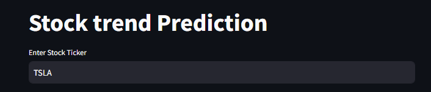
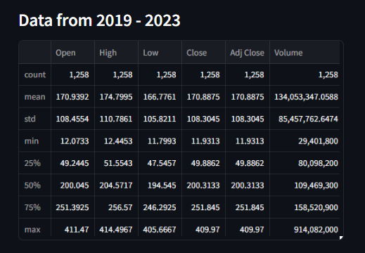
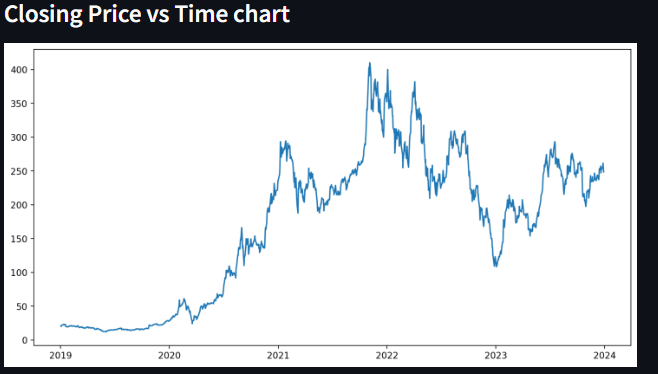
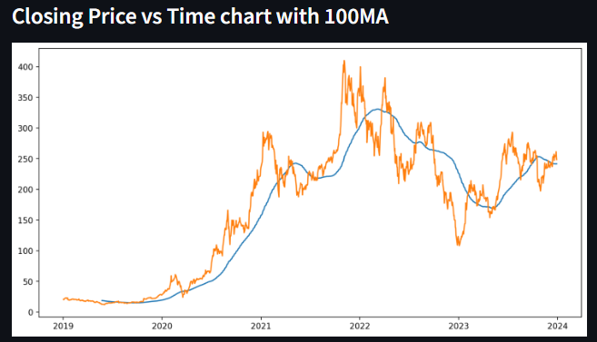
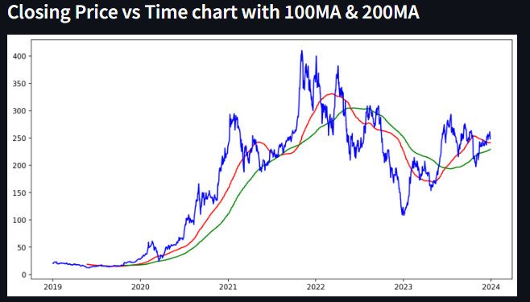
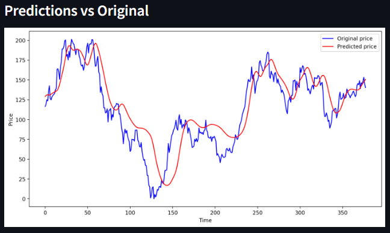

# Stock-Prediction-using-LSTM
 * Created a webApp using streamlit where stock ticker is entered and data is fetched from Yahoo Finance.
    By default the stock is TESLA (TSLA) 
     
 
 * Stock data is fetched is from the years of 2019 to 2023 
  
 * Different plot are plotted such as  
    1. Closing price vs Time 
      
    2. Closing Price vs Time with 100 Moving Average (MA) 
      
    3. Closing Price vs Time with 200 Moving Average (MA) 
      

   
* Final Graphs shows Predictions vs Orignal 
  
 
 

